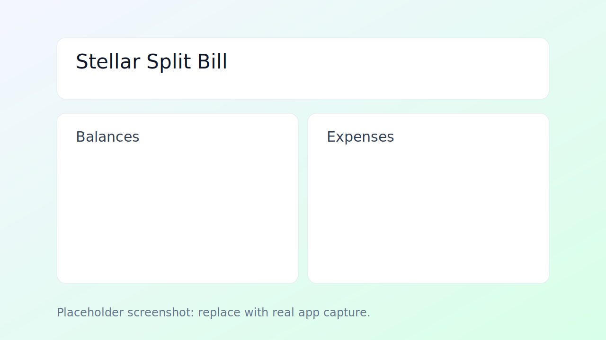
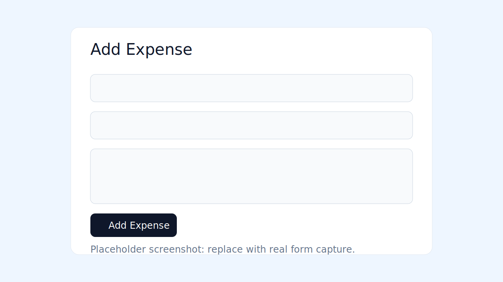
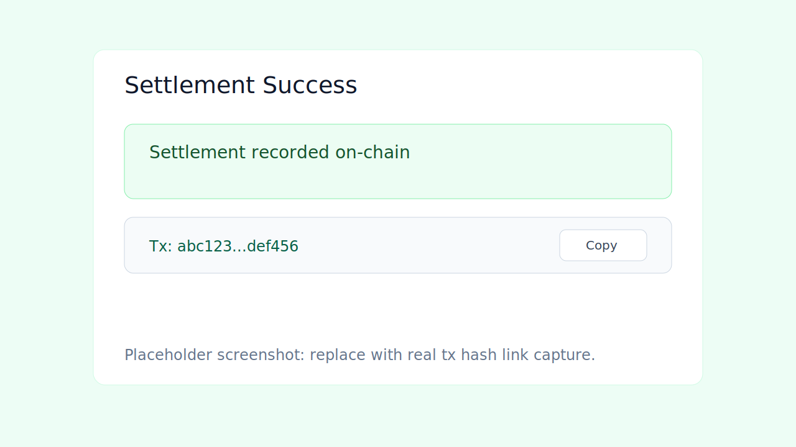

<<<<<<< HEAD
# 🚀 Stellar Soroban DApp — Full Stack Project

A complete decentralized application (DApp) built using **Rust (Soroban smart contracts)** and a **React + Vite frontend**, deployed on the **Stellar Testnet**.

---

## 📌 Project Overview

This project demonstrates how to:

* Build a smart contract using **Soroban SDK (Rust)**
* Compile it to **WebAssembly (WASM)**
* Deploy it on the **Stellar Testnet**
* Interact with it using a **React frontend**
* Connect a wallet using **Freighter API**

---

## 🏗️ Project Structure

```
stellarProject1/
│
├── contract/        # Rust Soroban smart contract
│   ├── src/
│   │   └── lib.rs
│   └── Cargo.toml
│
└── frontend/        # React + Vite frontend
    ├── src/
    │   ├── App.jsx
    │   └── utils/
    │       └── wallet.js
    └── package.json
```

---

## ⚙️ Tech Stack

### 🔹 Backend (Smart Contract)

* Rust
* Soroban SDK
* WebAssembly (WASM)

### 🔹 Frontend

* React
* Vite
* JavaScript

### 🔹 Blockchain Tools

* Stellar CLI
* Freighter Wallet

---

## 🔐 Smart Contract

### Example Function

```rust
#![no_std]

use soroban_sdk::{contract, contractimpl, Env};

#[contract]
pub struct Contract;

#[contractimpl]
impl Contract {
    pub fn hello(_env: Env) -> u32 {
        1
    }
}
```

---

## 🛠️ Setup Instructions

### 1️⃣ Install Rust

```bash
rustup update
```

---

### 2️⃣ Install WASM Target

```bash
rustup target add wasm32v1-none
```

---

### 3️⃣ Install Stellar CLI

```bash
cargo install --locked stellar-cli
```

---

## 🔑 Setup Wallet

```bash
stellar keys generate alice
stellar keys fund alice --network testnet
```

---

## 🧱 Build Smart Contract

```bash
cd contract
stellar contract build
```

---

## 🚀 Deploy Smart Contract

```bash
stellar contract deploy \
  --wasm target/wasm32v1-none/release/contract.wasm \
  --source alice \
  --network testnet
```

👉 Save the **Contract ID** returned after deployment.

---

## 🌐 Run Frontend

```bash
cd frontend
npm install
npm run dev
```

Open in browser:

```
http://localhost:5173/
```

---

## 🔌 Connect Wallet (Frontend)

Install **Freighter Wallet Extension**
Set network to **Testnet**

---

## 🔗 Connect Contract in Frontend

```js
const CONTRACT_ID = "YOUR_CONTRACT_ID_HERE";
```

---

## 🧪 Usage

1. Start frontend
2. Click **Connect Wallet**
3. Approve in Freighter
4. Call contract function (`hello`)
5. View result

---

## ⚠️ Common Issues

| Issue              | Fix                               |
| ------------------ | --------------------------------- |
| Blank frontend     | Check `index.html` and `main.jsx` |
| WASM not found     | Ensure correct build path         |
| CLI not recognized | Add `.cargo/bin` to PATH          |
| Metadata error     | Use `stellar contract build`      |

---

## 📦 Future Improvements

* Store on-chain data
* Add user inputs
* Build voting system
* Create token-based interactions
* Deploy frontend to Vercel/Netlify

---

## 🎯 Learning Outcomes

* Smart contract development in Rust
* WebAssembly compilation
* Blockchain deployment (Stellar)
* Wallet integration
* Full-stack DApp architecture

---

## 🙌 Acknowledgements

* Stellar Development Foundation
* Soroban Documentation
* Vite & React community

---

## 📄 License

This project is open-source and free to use for learning purposes.

---

## 💡 Author

Built as a hands-on project to learn **full-stack blockchain development using Stellar & Rust** 🚀
=======
# Stellar Split Bill dApp

A Soroban-powered split bill app built for hackathon demos.

## What It Does

- Add shared expenses on-chain (`payer`, `amount`, `participants`)
- Automatically maintain net balances per participant
- Settle balances with wallet-signed transactions (Freighter)
- Show latest expenses and balances from contract storage

## Tech Stack

- Smart Contract: Soroban (`Rust`, `soroban-sdk`)
- Frontend: `React` + `Tailwind` + `Vite`
- Wallet: `@stellar/freighter-api`
- Network: Stellar Testnet

## Demo Screenshots

### Wallet + Dashboard


### Add Expense


### Settle + Transaction Link


## Local Run

1. Build/deploy the contract from `contract/`.
2. Set frontend env:
   - `VITE_CONTRACT_ID`
   - `VITE_SOROBAN_RPC_URL`
   - `VITE_NETWORK_PASSPHRASE`
   - `VITE_TX_EXPLORER_BASE`
3. Run frontend:

```powershell
cd frontend
npm.cmd install
npm.cmd run dev
```

## Hackathon Test Script

Use two Freighter testnet accounts:

- `ADDR_A`
- `ADDR_B`

1. Connect as `ADDR_A`, add expense:
   - payer: `ADDR_A`
   - amount: `120`
   - participants: `ADDR_A,ADDR_B`
2. Switch wallet to `ADDR_B`, add expense:
   - payer: `ADDR_B`
   - amount: `30`
   - participants: `ADDR_A,ADDR_B`
3. Settle as `ADDR_B` to `ADDR_A`:
   - first settle `20`
   - then settle `25`

Expected final net balances: both users return to `0`.

## Deploy Frontend

### Option A: Vercel

```powershell
cd frontend
npm.cmd run build
npx vercel login
npx vercel --prod
```

Set env vars in Vercel project settings:

- `VITE_CONTRACT_ID`
- `VITE_SOROBAN_RPC_URL`
- `VITE_NETWORK_PASSPHRASE`
- `VITE_TX_EXPLORER_BASE`

### Option B: Netlify

```powershell
cd frontend
npm.cmd run build
npx netlify login
npx netlify deploy --prod --dir=dist
```

Set the same env vars in Netlify site settings.
>>>>>>> 9869a52 (Initial commit with frontend and contract)
